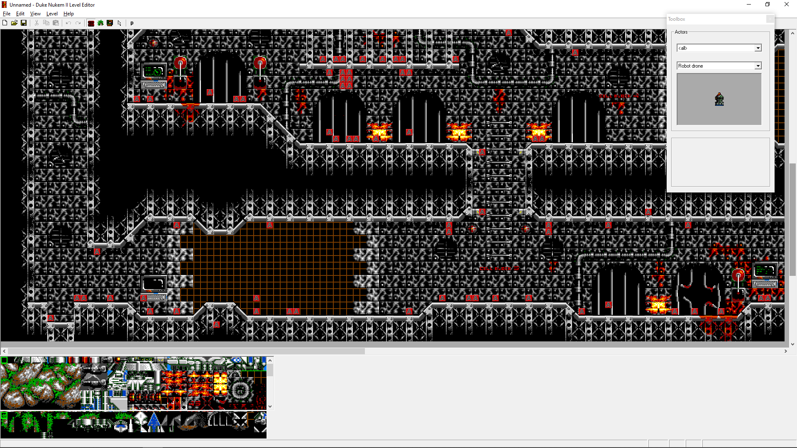
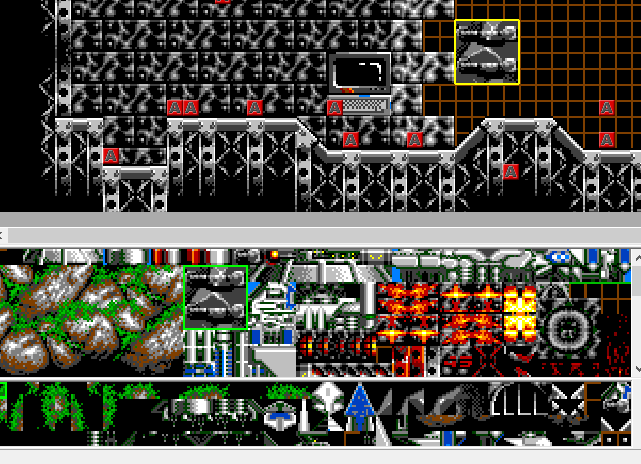
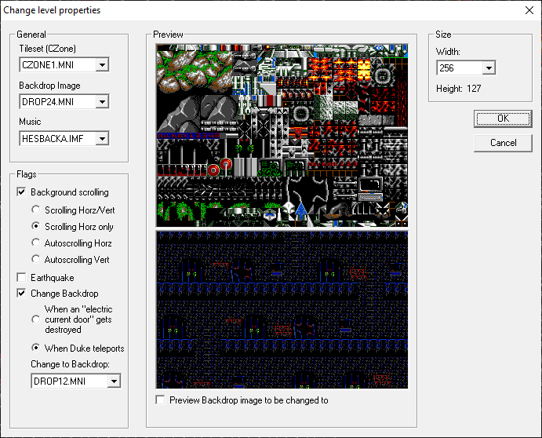

# Duke2Edit

A basic level editor for Duke Nukem 2, written in C++.
Windows only, uses DirectX 9 and the Win32 API.

I wrote this back in 2006 while still in highschool, so the code is quite messy and absolutely not up to my standards of today: Manual memory management, outdated paradigms, overcomplicated logic, poor structure, not cross-platform, etc.
There are also some bugs and stability issues.
It's overall still fairly functional though -
it was successfully used during development of [Duke Nukem 1+2 Remastered for Evercade](https://evercade.co.uk/duke-nukem/).

I've decided to release the code in case someone finds it
useful, or wants to do develop it further.
I don't have any intention to work on this myself,
but I'm happy to try and answer any questions about the code if I can (I won't necessarily
remember everything).

## Features and instructions

Download a precompiled binary [here](https://github.com/lethal-guitar/Duke2Edit/releases).

The editor's EXE must be placed in the same directory as the Duke Nukem 2 installation - specifically, the file `NUKEM2.CMP` must be in the same directory as the EXE.

Launching the editor will open a new, empty map. Use the menu to open existing level files anywhere on your computer, or one of the official levels from the game via the `Import from CMP` option.

Most of the UI should be relatively self-explanatory. To edit the current level, there are 4 different modes that can be selected in the toolbar, which influence what happens when using the mouse in the editor.

* Solid tiles mode (red brick icon): Place tiles in the level. Select the tile(s) to place in the tileset view at the bottom of the window.
* Masked tiles mode (grass icon): Like solid tiles mode, but for "masked" tiles. Masked tiles are partially transparent, and can be placed on top of already placed solid tiles to add a secondary layer of tiles (with some constraints).
* Actor mode (circuit board icon): Place actors into the level. To select which actor to place, use the floating actor selection tool window. To delete an already placed actor, hold Shift and click on the actor.
* Select mode (mouse cursor icon): Use this to select a part of the level, move it around, or copy&paste.

Note that you can select more than 1 tile in the tileset view by dragging a selection.
Clicking in the editor view will then place all of the selected tiles at once.

Use the level properties dialog from the menu to change the level's tileset, music, background, and other attributes.

The status bar at the bottom of the window shows the following information:

#### In map view

* Current position in tile coordinates
* Tile index of solid tile under cursor
* Tile index of masked tile under cursor, if any
* Id and description of actor under cursor, if any

#### In tileset view

* Tile index of highlighted tile
* List of tile attributes (collision, ladder, climbable etc.)

### Building the code

I made the necessary changes to the code to make it compile with Visual Studio 2019 or newer (the original toolchain was - I believe - Visual Studio 6.0).
To build it, open the included VS solution file and then build from within VS.
I have not tested doing a 64-bit build, it most likely doesn't work out of the box.
No 3rd party dependencies are required.

In order to launch the editor from Visual Studio, `NUKEM2.CMP` must be placed into the root of the repository.

## Comparison to other editors

Compared to [K1n9_Duk3's Enormous Tool](https://k1n9duk3.shikadi.net/duke2edit.html), this editor has far fewer features and more bugs.
Unlike the former, its UI is a native Windows UI though, which means that the editor works better on modern high-resolution displays.

## Known issues

* Dragging a selected area past the edges of the map causes a crash
* Copy&pasting a selected area doesn't correctly copy actors (it seems to work, but the copied actors are all reset to type 0).
* When dragging to select a block of tiles, dragging to the top/left will behave weirdly
* Alt-tabbing away and back, moving or resizing the window, and some other actions cause the editor's scroll position to be reset back to top-left
